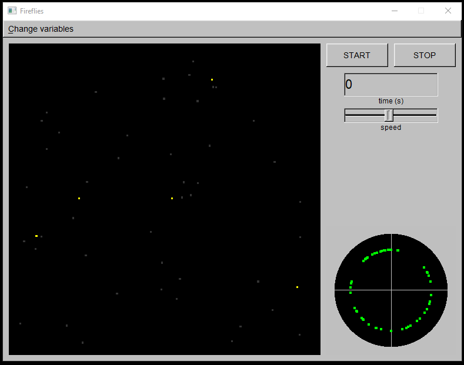

A **C++ software** simulating the synchronization of fireflies by means of a dynamical model.<br />



The simulation was advanced in time using a fourth order Runge-Kutta method, whose implementation is displayed in the below code snippet.

```cpp
double K1, K2, K3, K4, L1, L2, L3, L4;
 double sum;
 vettore distanza;
    double P (int i, double theta_aggiornato) {
    sum = 0;
    for (int j = 0; j < firefly::N; j++) {
       distanza = f[i].getPosition() - f[j].getPosition();
       if (j != i && distanza.getModulo() <= firefly::r)
       sum += sin(f[j].getTheta() - theta_aggiornato);
     }
     return sum;
 }
 void RK4 () {
    for (int i = 0; i < firefly::N; i++) {
       K1 = f[i].getOmega();
       L1 = epsilon*f[i].getOmega_nat() - epsilon*f[i].getOmega() -
            ((f[i].getOmega_max() - f[i].getOmega_min())/2) *
            sin(f[i].getTheta())*P2(i);

       [...]

       f[i].getTheta() += dt * (K1 + 2.0 * K2 + 2.0 * K3 + K4) / 6.0;
       f[i].getOmega() += dt * (L1 + 2.0 * L2 + 2.0 * L3 + L4) / 6.0;
       f[i].checkPhase();
       }
       t += dt;
 }
```