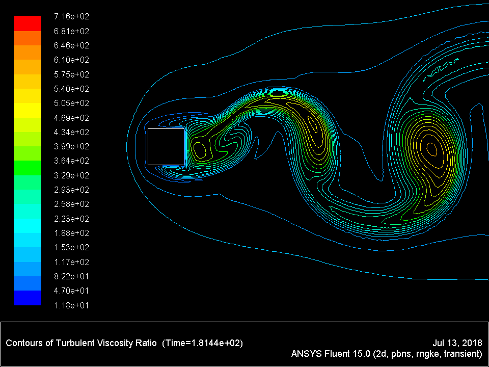

Name of the project: **Comparison of standard k-ε and k-ε RNG calculations of the flow around a square cylinder**.

I applied different turbulence models to simulate the flow around a square cylinder.

